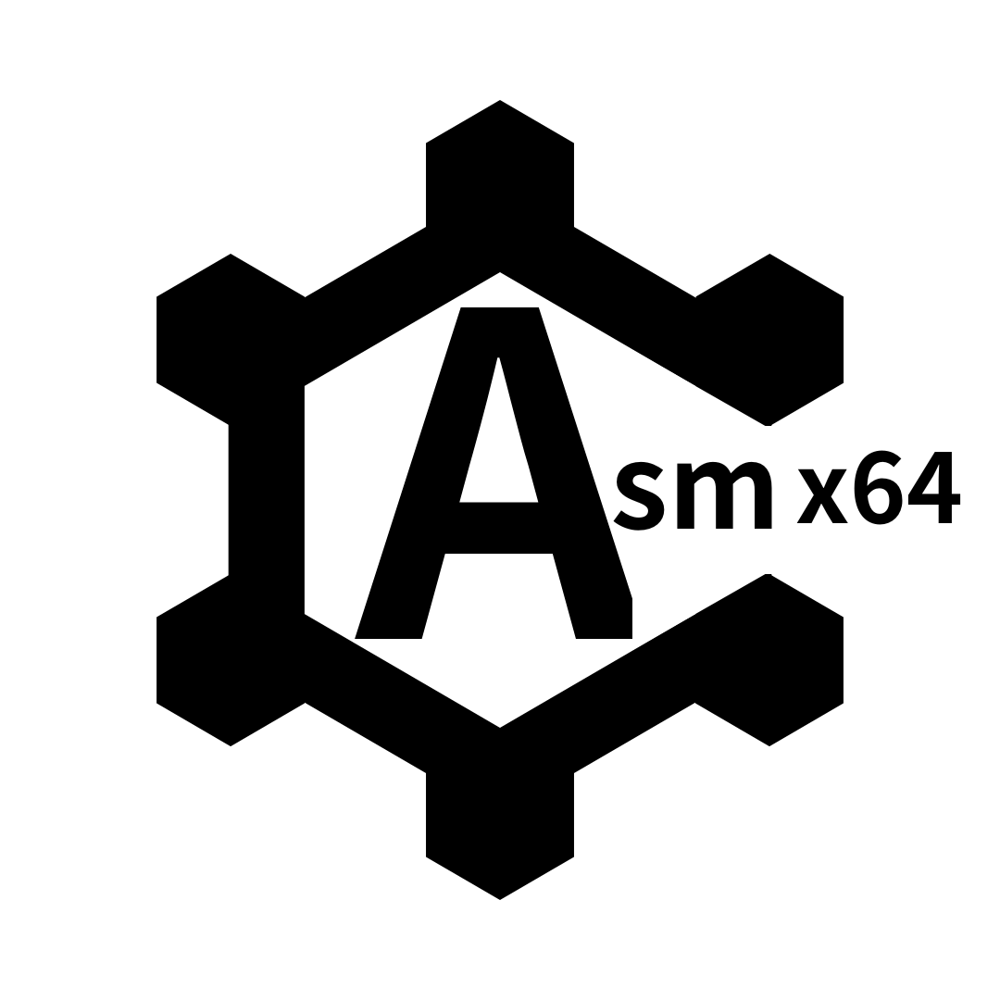

<p align="center">
  
</p>

# Hasm-x86_64 | Hexl Assembler for x86_64 Architecture | Hasm

Rustで開発された、プログラミング言語 **Hexl** 専用のx86_64アセンブラです。

## 📌 概要
Hexlコンパイラが生成する中間コードを、実行可能なバイナリへとアセンブルするためのツールです。
コンパイラ開発者が低レイヤーの処理を抽象化し、効率的に開発を進められるように設計されています。

## ✨ 特徴
- **Hexl言語への最適化**: 一時的に生成される中間コードの高速なアセンブル。
- **コンパイラ開発の支援**: 複雑なマシンコード生成を自動化し、自作言語の開発を容易にします。
- **Rust製**: 高い安全性とパフォーマンスを両立（Rust 1.75.0+ 推奨）。

## 🛠 使用技術
- **Language**: [Rust](https://rust-lang.org) (Stable)
- **Target**: x86_64

## 🚀 使い方（クイックスタート）
- Linuxにしかまだ対応していません
```bash
# リポジトリのクローン
git clone https://github.com
cd path/to/hasm-x64

# ビルド
cargo build --release
```
## 📄 ライセンス
このプロジェクトは **[MIT License](./LICENSE.txt)** のもとで公開されています。
個人・商用問わず、自由に使用・改変・配布が可能です。

---
© 2026 Ryuusei/Organization.
