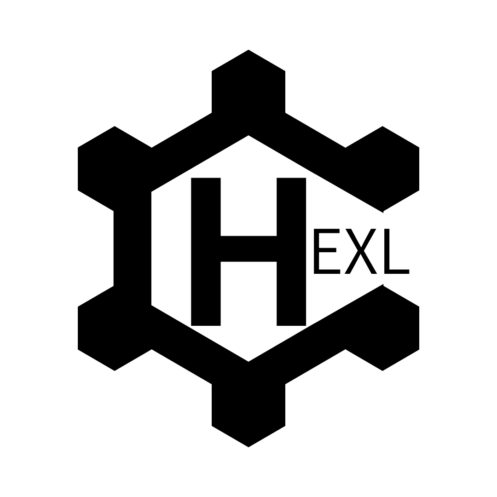

  

# HexlLanguage - 自作プログラミング言語 / Custom Programming Language
Hexlはrustで実装されたプログラミング言語であり
字句解析・構文解析・AST・コンパイラを自前で実装しており、
自分で使うことと学習を目的としています

## 概要（Overview）
このプロジェクトは私が使うプログラミング言語を作る

## 特徴（Features）
- 自作プログラミング言語
- 静的型付け
- シンプルな構文

## 目的（Motivation）
- 極限までキーワードを減らしシンプルな構文
- 低レイヤ寄りの言語作成
- 言語処理系・コンパイラ・インタプリタの学習目的で開発しています。

## Changelog
- [CHANGELOG.md](./CHANGELOG.md)
